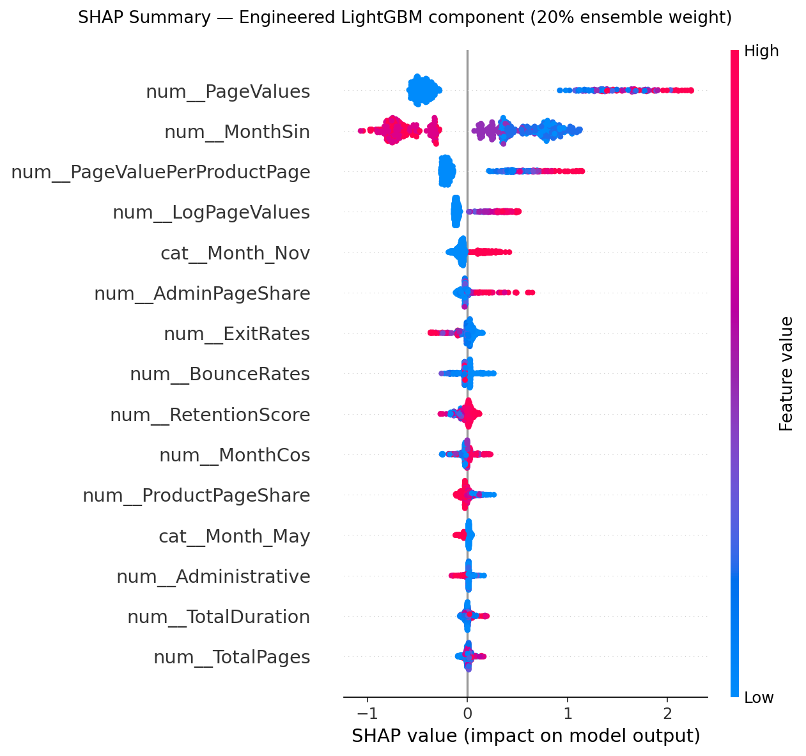

# Buy or Bye 🛒

Bir e-ticaret oturumunun satın alma ile sonuçlanma olasılığını tahmin eden, tahmini SHAP ile açıklayan ve Streamlit üzerinden what-if analizi sunan uçtan uca makine öğrenmesi projesi.

Tüm veri istatistikleri, deneyler, hyperparameter tuning, feature engineering, model
sonuçları, SHAP, segmentasyon ve sınırlamaları içeren ayrıntılı rapor:
[`PROJECT_TECHNICAL_REPORT.md`](PROJECT_TECHNICAL_REPORT.md).

[`Streamlit Page`](https://buy-or-bye.streamlit.app)

## Sonuç

Ham 12.330 oturumdaki 125 exact duplicate splitten önce kaldırıldı; 12.205 tekil oturum stratified %70/%15/%15 train/validation/test ayrımıyla işlendi. Hiperparametre araması yalnız train setinde 5-fold CV PR-AUC ile, calibration train OOF tahminleriyle ve karar eşiği validation setinde FN=2/FP=1 maliyetiyle yapıldı. Test seti yalnız final raporlamada kullanıldı.

| Model | 5-fold CV PR-AUC | Std | Train CV PR-AUC |
|---|---:|---:|---:|
| Logistic Regression | 0.6554 | 0.0264 | 0.6567 |
| Random Forest | 0.7522 | 0.0075 | 0.9040 |
| **LightGBM** | **0.7549** | **0.0079** | 0.8343 |

Feature engineering sonrası:

| Model | 5-fold CV PR-AUC | Std | Train CV PR-AUC |
|---|---:|---:|---:|
| Engineered Random Forest | 0.7529 | 0.0077 | 0.8837 |
| **Engineered LightGBM** | **0.7562** | **0.0080** | 0.8614 |

Validation protokolüyle promote edilen final `%80 Random Forest + %20 Engineered LightGBM` ensemble test sonuçları: **ROC-AUC 0.9320**, **PR-AUC 0.7448**, **precision 0.5870**, **recall 0.7902**, **F1 0.6736** ve accuracy 0.8804. Seçilen maliyet-duyarlı eşik **0.25**. Tekil Engineered LightGBM test PR-AUC `0.7507` ile daha yüksek olsa da test seçim için kullanılmadı.

Ensemble calibration test Brier skoru `0.0860 → 0.0696`, log loss `0.2805 → 0.2270` iyileşti. Engineered LightGBM beş farklı seed üzerinde PR-AUC `0.7662 ± 0.0077`; Feb–Oct → Nov–Dec temporal proxy PR-AUC `0.6655`.



## Proje yapısı

```text
├── data/raw/                         # UCI CSV
├── notebooks/01_eda_modeling.ipynb  # Çıktıları kayıtlı EDA/modelleme
├── src/                              # Veri, pipeline, eğitim, değerlendirme, tahmin, SHAP
├── app/streamlit_app.py              # İnteraktif demo
├── models/                           # Eğitilmiş pipeline ve threshold metadata
├── outputs/                          # Headless üretilen EDA, metrik ve SHAP görselleri
├── PROJECT_TECHNICAL_REPORT.md       # Ayrıntılı teknik rapor
├── scripts/generate_deliverables.py  # Notebook ve EDA üretimi
└── tests/                             # Birim testleri
```

## Kurulum

Python 3.10–3.12 önerilir. macOS üzerinde LightGBM için `brew install libomp` gerekebilir.

```bash
python3.11 -m venv .venv
source .venv/bin/activate
pip install -r requirements.txt
```

Veri dosyası repoda bulunur. Bulunmadığında `src.data.load_data()` UCI dataset 468'i `ucimlrepo` ile indirmeyi dener.

## Çalıştırma

Demo:

```bash
streamlit run app/streamlit_app.py
```

Tam 5-fold tuning, calibration ve robustness analizleriyle final artifact'i üretmek için:

```bash
python -m src.tune
```

Feature engineering karşılaştırmasını ve engineered model tuning'ini yeniden çalıştırmak için:

```bash
python -m src.feature_experiment
```

Random Forest + Engineered LightGBM soft-voting deneyini çalıştırmak için:

```bash
python -m src.ensemble_experiment
```

Notebook ve EDA görsellerini mevcut eğitim sonuçlarından yeniden üretmek için:

```bash
python -m scripts.generate_deliverables
```

Tüm statik grafikleri headless `Agg` backend ile `outputs/` altında yeniden üretmek için:

```bash
python -m scripts.generate_outputs
```

Testler:

```bash
pytest -q
```

Son yerel doğrulama: **5 Ağustos 2026**, Python **3.11.15** — `28 passed, 14 warnings in 2.73s`.

## Uygulama özellikleri

- 17 oturum özelliğinden satın alma olasılığı
- Kalibre `predict_proba()` skorundan üç kademeli niyet segmentasyonu
- Her segment için uygulanabilir iş aksiyonu ve hedefi
- Optimize karar eşiği ve model metrikleri
- Altı kullanıcı-kontrollü davranış özelliğinden biri seçilerek interaktif what-if duyarlılık grafiği
- Etiketsiz CSV için toplu olasılık/segment scoring ve sonuç indirme
- `Revenue` etiketli CSV için ROC-AUC, PR-AUC, precision, recall, F1, accuracy ve confusion matrix
- Teknik model kolonlarından bağımsız kullanıcı dostu Türkçe alan adları, yardım balonları ve CSV veri sözlüğü
- Manuel demoda sabit analytics referansları: Bounce `0.002899`, Exit `0.025000`, Page Value `0.50`, Special Day `0.0`
- Tek tahmin için SHAP etkenleri ve yönleri
- Önyüzde renkli lokal SHAP katkıları ve `%20` ağırlıklı Engineered LightGBM bileşeni için global SHAP sıralaması
- Global SHAP summary ve model-native feature importance
- Bilinmeyen kategorileri güvenle işleyen tek parça preprocessing + model pipeline'ı

Global SHAP raporunu mevcut model için yeniden üretmek üzere:

```bash
python -m src.shap_report
```

## Olasılık segmentasyonu

Binary çıktı karar eşiğiyle geriye dönük uyumluluk için korunur; operasyonel kararlar ise
final ensemble'ın kalibre edilmiş `0.00–1.00` satın alma olasılığı üzerinden verilir.

| Olasılık | Segment | Önerilen iş yaklaşımı |
|---|---|---|
| `0.000–0.125` | Düşük niyet | Ücretli teşvik verme; düşük maliyetli içerik ve retargeting |
| `0.125–0.250` | Değerlendirme | Sosyal kanıt, karşılaştırma, stok/kargo bilgisi |
| `0.250–1.000` | Yüksek niyet | Checkout desteği, hatırlatma ve kontrollü teşvik testi |

Sınırlar mevcut validation-optimize `0.25` eşiğine bağlıdır: `0.125` bu eşiğin yarısıdır.
Segment sonuçlarını yeniden üretmek için:

```bash
python -m src.segment_analysis
```

Makine-okunur sonuçlar `reports/segment_report.json`, grafik ise
`outputs/segment_performance.png` altında oluşturulur.

Üç segmentin sabit test bölümündeki gerçek dönüşüm oranları sırasıyla `%2.7`, `%19.7`
ve `%58.7` oldu; yüksek niyet segmenti gerçek alıcıların `%79.0`ını yakaladı.
Bu monoton artış segmentlerin niyet seviyesini anlamlı biçimde ayırdığını gösterir.
Aksiyonların nedensel ticari etkisi kampanya maliyeti ve marj gözetilerek A/B testleriyle doğrulanmalıdır.

## Veri

[UCI Online Shoppers Purchasing Intention Dataset](https://archive.ics.uci.edu/dataset/468/online+shoppers+purchasing+intention+dataset), ham 12.330 / deduplicate edilmiş 12.205 oturum, 17 input özelliği ve `Revenue` hedefi. Lisans: CC BY 4.0, DOI: 10.24432/C5F88Q.

## Tuning ve robustness

- Logistic Regression: 12 parametre kombinasyonu × 5 fold.
- Random Forest: 8 rastgele kombinasyon × 5 fold.
- LightGBM: 16 rastgele kombinasyon × 5 fold; seçilmesi hâlinde early stopping yolu hazır.
- Random Forest optimumları: 350 ağaç, `min_samples_leaf=8`, `min_samples_split=10`, `max_features=0.5`, `class_weight=balanced_subsample`.
- Feature engineering: toplam/sayfa başına süre, sayfa payları, engagement, retention, log dönüşümleri, döngüsel ay ve davranış etkileşimlerinden oluşan 27 yeni özellik.
- Engineered LightGBM: 5-fold PR-AUC `0.7562`; early stopping optimumu 115 boosting turu.
- PageValues ablation: CV PR-AUC `0.7562 → 0.3797`; özellik kritik ve leakage riski yüksektir.
- Harici site validasyonu yapılamadı çünkü veri yalnız tek, kimliği belirsiz site içeriyor.

Detaylı makine-okunur rapor: [`reports/tuning_report.json`](reports/tuning_report.json).

Feature engineering karşılaştırması: [`reports/feature_engineering_report.json`](reports/feature_engineering_report.json).

## Ensemble deneyi

Random Forest ve Engineered LightGBM, train üzerindeki 5-fold OOF tahminlerle ayrı ayrı kalibre edildi. Validation ikiye ayrıldı: ilk yarıda ağırlık, ikinci yarıda threshold seçildi. Arama `RF=0.80 / LightGBM=0.20` sonucunu verdi; ensemble validation PR-AUC'yi en iyi bileşenden `0.0036` yükselttiği için final modele terfi ettirildi.

| Validation ağırlık seti | PR-AUC |
|---|---:|
| Random Forest | 0.7250 |
| Engineered LightGBM | 0.7206 |
| Optimize ensemble | **0.7286** |

Deney raporu: [`reports/ensemble_report.json`](reports/ensemble_report.json). Ağırlık grafiği: [`outputs/ensemble_weight_search.png`](outputs/ensemble_weight_search.png).

## Bilinen sınırlar

- `PageValues` güçlü bir özellik ve gerçek zamanlı kullanımda potansiyel leakage riski taşır.
- Global/lokal SHAP final ensemble'ın yalnız `%20` ağırlıklı Engineered LightGBM bileşenini açıklar.
- Veri tek bir e-ticaret sitesinden ve yaklaşık bir yıllık dönemden gelir; genellenebilirlik ayrıca doğrulanmalıdır.
- Sınıf dağılımı dengesizdir (%15,5 pozitif); bu nedenle ana seçim metriği accuracy değil PR-AUC'dir.
- SHAP değerleri model katkısını açıklar, nedensellik göstermez.

Sonraki adımlar: gerçek timestamp ile zaman bazlı validasyon, ikinci site üzerinde external validation, gerçek zamanlı scoring API ve kampanya A/B testi.
